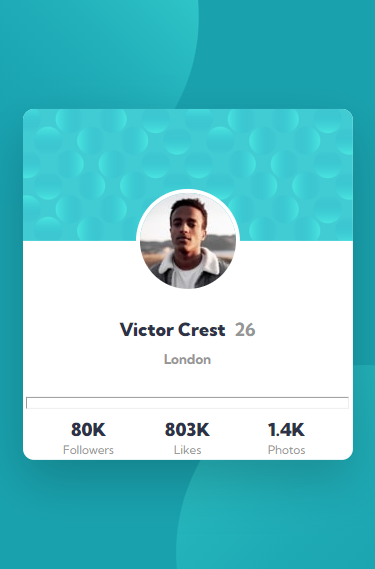
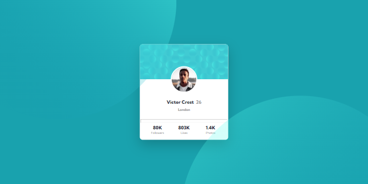

# FM-Profile-card-component
Frontend Mentor | Profile card component

## Table of contents

- [Overview](#overview)
  - [The challenge](#the-challenge)
  - [Screenshot](#screenshot)
  - [Links](#links)
  - [Built with](#built-with)
  - [Author](#author)

**Note: Delete this note and update the table of contents based on what sections you keep.**

## Overview

### The challenge

Users should be able to:

- View the optimal layout depending on their device's screen size

### Screenshot

<figure style="display: flex;">
  
  
</figure>

### Links

- Solution URL: https://www.frontendmentor.io/solutions/nft-preview-card-component-vpzwGSKXsR
- Live Site URL: https://front-mentor-profile-card-component.netlify.app/

### Built with

- Semantic HTML5 markup
- CSS custom properties
- Flexbox

## Author

- Frontend Mentor - https://www.frontendmentor.io/profile/abdellah-abadou
